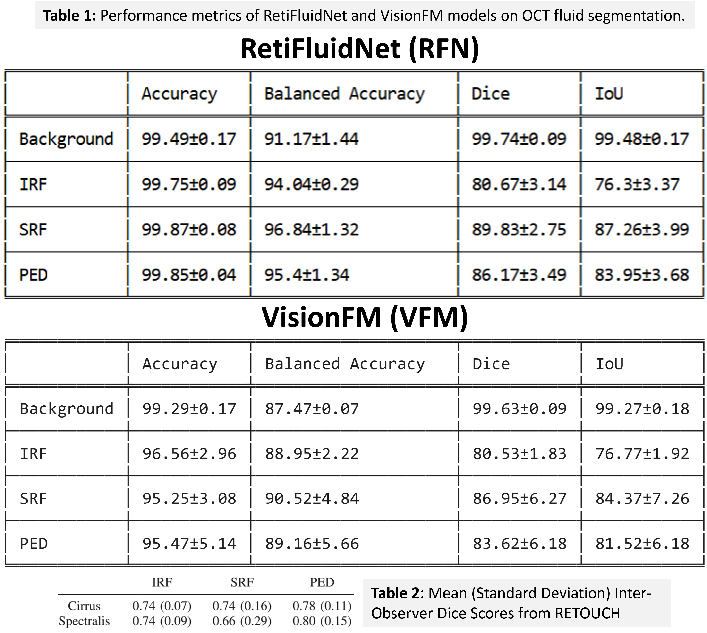
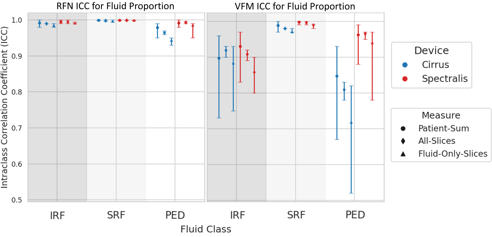
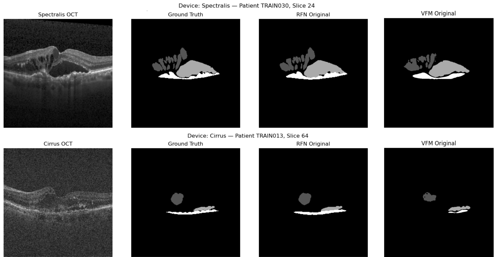

# One Size Fits All? Comparing Foundation and Task-specific Models for Retinal Fluid Segmentation

**RetiFluidNet (task-specific)** vs **VisionFM (foundation)** for segmenting intraretinal fluid (IRF), subretinal fluid (SRF), and pigment epithelial detachment (PED) on OCT B-scans. Using the RETOUCH benchmark, we build two reproducible pipelines: TensorFlow for RetiFluidNet and PyTorch for VisionFM, run 3-fold cross-validation across Spectralis and Cirrus devices, and evaluate pixel-level accuracy (Acc, BAcc, Dice, IoU) and patient and slice level agreement via fluid-proportion quantification and ICC. Overall, RFN delivers consistently stronger segmentation accuracy and more stable fluid quantification than VFM with qualitative examples illustrating cleaner fluid boundaries.

- **Pipelines:** Refer to the subfolders: **RetiFluidNet** for the task-specific model, and **VisionFM** for the foundation model. 
- **Dataset:** RETOUCH—Retinal OCT Fluid Challenge (https://retouch.grand-challenge.org/)  
- **Metrics:** Dice (DSC), Balanced Accuracy (BACC), ICC for fluid proportion (patient-sum, all-slices, fluid-only)  

## Methods:

We compare 24 Spectralis volumes (1176 B-scans at 512×496 pixels) and 24 Cirrus volumes (3072 B-scans at 512×1024 pixels). All raw files were converted to PNG and resized to 256×256 pixels, with intensities normalized to [0,1]. We then applied random translations, rotations, flips, and contrast adjustments for augmentation. Models were trained and evaluated via 3-fold cross-validation with 39648 augmented images per training fold.

## Results at a Glance

  
   <em><strong>Table 1.</strong> Dice Similarity Coefficient (DSC) and Balanced Accuracy (BACC) for RFN and VFM.</em>

  
   <em><strong>Figure 1.</strong> Intraclass correlation coefficients (ICC) for fluid proportion across devices and measures.</em>

  
   <em><strong>Figure 2.</strong> Example Spectralis (top) and Cirrus (bottom) slices with GT, RFN, and VFM segmentations.</em>

## Acknowledgments
I gratefully acknowledge BIDS@I2DB Summer Research Internship, Institute for Informatics, Data Science & Biostatistics, Washington University School of Medicine for the oppotuniry. And all members from the CausAI lab for guidiance and supports.

